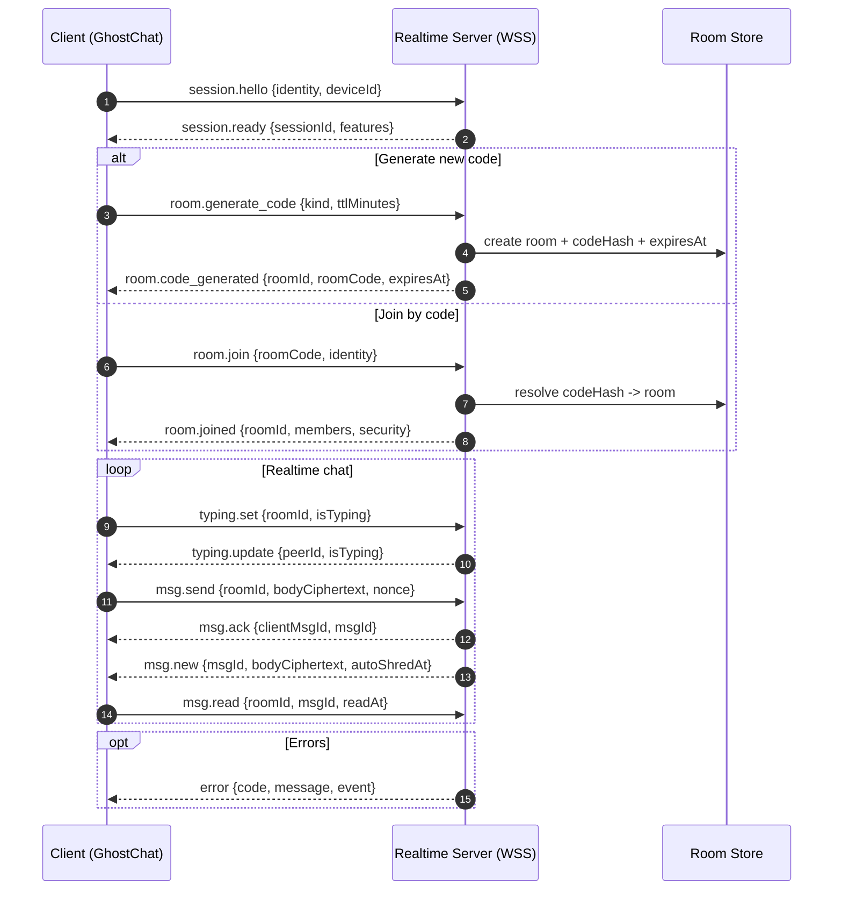

# GhostChat Realtime Contract (MVP)

This folder defines the backend contract for GhostChat realtime messaging.

## Goals
- Keep transport generic (`WebSocket` or `Socket.IO`).
- Use an envelope format for all messages.
- Keep payloads privacy-focused (no required traditional account fields).
- Support code-first room access (`generate code -> join by code -> chat`).

## Files
- `events.ts`: event constants + TypeScript payload/envelope types.
- `schemas/client-events.schema.json`: JSON Schema for client -> server events.
- `schemas/server-events.schema.json`: JSON Schema for server -> client events.

## Envelope
All events use this common wrapper:

```json
{
  "v": "1.0",
  "event": "room.join",
  "reqId": "req_123",
  "ts": 1760000000000,
  "data": {}
}
```

- `v`: contract version.
- `event`: event name string.
- `reqId`: optional request correlation id (recommended for request/ack flows).
- `ts`: epoch milliseconds.
- `data`: event payload.

## Security Notes
- Use `wss://` only.
- Hash normalized room code server-side for persistence (`codeHash`), never store plaintext code in long-term DB.
- Encrypt message body client-side before emit when E2EE is enabled.
- Prefer short room TTL and message auto-shred metadata.

## Suggested Handshake Sequence
1. Client emits `session.hello`
2. Server replies `session.ready`
3. Client emits `room.generate_code` or `room.join`
4. Server emits `room.code_generated` / `room.joined`
5. Chat events start: `typing.set`, `msg.send`, `msg.new`, `msg.ack`

## Usage Guide

### 1) Type-safe usage in app code

```ts
import {
  CONTRACT_VERSION,
  CLIENT_EVENTS,
  type ClientEnvelope,
  type AnyServerEnvelope,
} from "./events";

const hello: ClientEnvelope<typeof CLIENT_EVENTS.SESSION_HELLO> = {
  v: CONTRACT_VERSION,
  event: CLIENT_EVENTS.SESSION_HELLO,
  reqId: "req_hello_1",
  ts: Date.now(),
  data: {
    deviceId: "device_abc",
    appVersion: "0.1.0",
    identity: { username: "🦊 Phantom", emoji: "🦊" },
  },
};

socket.send(JSON.stringify(hello));

socket.onmessage = (raw) => {
  const event = JSON.parse(String(raw.data)) as AnyServerEnvelope;
  if (event.event === "room.joined") {
    console.log("Joined room", event.data.roomId, event.data.roomCode);
  }
};
```

### 2) Runtime validation

- Validate every inbound client event against `schemas/client-events.schema.json` on the server gateway.
- Validate every outbound server event against `schemas/server-events.schema.json` before sending.
- Reject invalid payloads with `error` event (`code: "BAD_PAYLOAD"`).

### 3) Request correlation

- Include `reqId` on request-like events (`session.hello`, `room.join`, `msg.send`).
- Echo the same `reqId` in success/error responses so clients can resolve pending actions.

## Handshake Guide (Detailed)

### A) Session bootstrap

Client -> Server (`session.hello`):

```json
{
  "v": "1.0",
  "event": "session.hello",
  "reqId": "req_1",
  "ts": 1760000000000,
  "data": {
    "deviceId": "device_abc",
    "appVersion": "0.1.0",
    "identity": { "username": "🦅 Falcon", "emoji": "🦅" }
  }
}
```

Server -> Client (`session.ready`):

```json
{
  "v": "1.0",
  "event": "session.ready",
  "reqId": "req_1",
  "ts": 1760000000100,
  "data": {
    "sessionId": "sess_9f3",
    "serverTime": 1760000000100,
    "features": { "e2ee": true, "autoShred": true, "groups": true }
  }
}
```

### B) Code generation path

1. Client sends `room.generate_code` with `kind` and `ttlMinutes`.
2. Server returns `room.code_generated` with `roomId`, `roomCode`, `expiresAt`.
3. Client may immediately call `room.join` using returned `roomCode`.

### C) Join-by-code path

Client -> Server (`room.join`):

```json
{
  "v": "1.0",   "event": "room.join",
  "reqId": "req_join_1",
  "ts": 1760000000200,
  "data": {
    "roomCode": "FA-7741",
    "identity": { "username": "🦊 Phantom", "emoji": "🦊" }
  }
}
```

Server -> Client (`room.joined`):

```json
{
  "v": "1.0",
  "event": "room.joined",
  "reqId": "req_join_1",
  "ts": 1760000000300,
  "data": {
    "roomId": "room_bf7",
    "roomCode": "FA-7741",
    "kind": "direct",
    "joinedAt": 1760000000300,
    "members": [{ "peerId": "p1", "username": "🦊 Phantom", "emoji": "🦊", "online": true }],
    "security": { "e2eeRequired": true, "algorithm": "AES-256-GCM" }
  }
}
```

### D) Chat event loop

1. Client emits `typing.set` (`isTyping: true/false`).
2. Client emits `msg.send` with encrypted content (`bodyCiphertext`, optional `nonce`).
3. Server emits `msg.ack` to sender (delivery confirmation).
4. Server emits `msg.new` to room members.
5. Client emits `msg.read` optionally for read receipts.

### E) Error handling

Server should emit `error` with one of:

- `INVALID_CODE`
- `ROOM_EXPIRED`
- `ROOM_FULL`
- `UNAUTHORIZED`
- `RATE_LIMITED`
- `BAD_PAYLOAD`
- `INTERNAL`

## Sequence Diagram (Mermaid)


